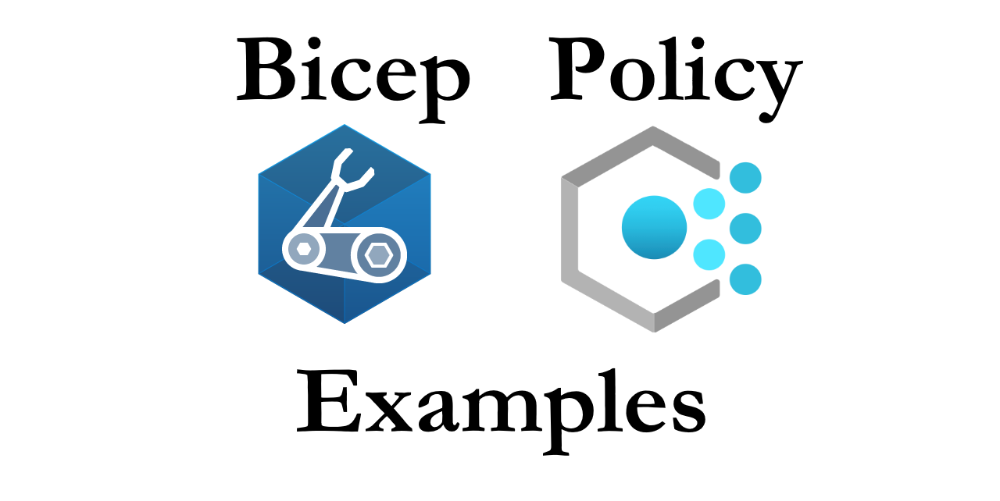

# Azure Policy As Code

> *Bicep + Policy icons are from Microsoft*

* Bicep
    * Level1
    * Level2
    * Level3

Get in touch :octocat:

* Twitter: [@coder_au](https://twitter.com/coder_au)
* LinkedIn: [@JesseLoudon](https://www.linkedin.com/in/jesseloudon/)
* Web: [jloudon.com](https://jloudon.com)
* GitHub: [@JesseLoudon](https://github.com/jesseloudon)

Learning resources :books:
* [https://github.com/Azure/bicep](https://github.com/Azure/bicep)
* [https://docs.microsoft.com/en-us/azure/governance/policy/overview](https://docs.microsoft.com/en-us/azure/governance/policy/overview)

Blogs that might interest you :pencil:

* [Azure Spring Clean: DINE to Automate your Monitoring Governance with Azure Monitor Metric Alerts](https://jloudon.com/cloud/Azure-Spring-Clean-DINE-to-Automate-your-Monitoring-Governance-with-Azure-Monitor-Metric-Alerts/)